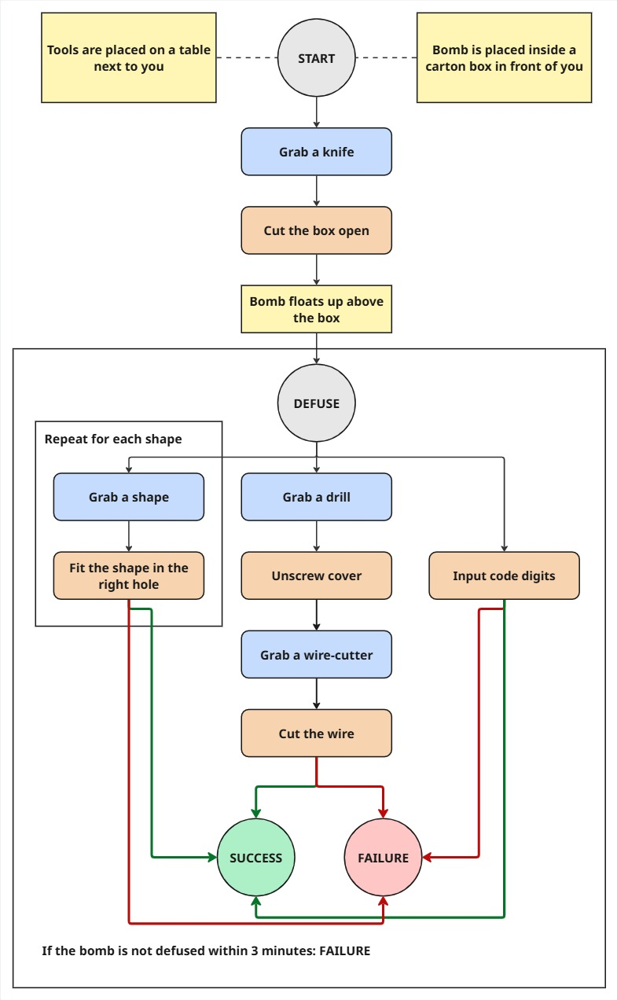

# VR Bomb Puzzle

This VR Unity game is a timed, interactive puzzle based on the flowchart shown below. The player follows a sequence of actions such as selecting tools, fitting shapes, cutting wires, or entering a code in order to successfully “defuse” the object. Using VR makes the experience more immersive, since the player has to physically reach out, grab items, and interact with objects in a 3D space. This adds a level of realism and urgency that increases engagement, improves hand–eye coordination, and supports problem-solving in a more practical, skill-based way than a regular desktop game.

Below is a diagram explaining the flow of the game from the player's perspective.

### Blog Posts

A series of blog post were managed across the development of this VR project. These posts depict the implementation process from all three weeks together with some decision explanation and design details.

- [Lab Day 4](https://github.com/JakubCerovsky/XRD/blob/main/blogposts/lab_4.md)
- [Lab Day 5](https://github.com/JakubCerovsky/XRD/blob/main/blogposts/lab_5.md)
- [Lab Day 6](https://github.com/JakubCerovsky/XRD/blob/main/blogposts/lab_6.md)

### Video Demonstration

[VR Bomb Puzzle Demo](https://http.dev/501)

### Contributors:

- [Jakub Cerovsky](https://github.com/JakubCerovsky)
- [Alexandro Bolfa](https://github.com/Reblayzer)
- [Cosmin Gabriel Demian](https://github.com/cosmindemian)
- [Marcus Cristofer Mitelea](https://github.com/mitmarcus)

### Tools Used

- [Unity 6.2](https://unity.com/)
- [Blender](https://www.blender.org/)
- [Meta Quest Link](https://www.meta.com/en-gb/help/quest/1517439565442928/)

### Code References

The following resources were used during the project development process.

Assets

- [Rock Wall Basement with Baked Lighting](https://skfb.ly/oEKnK)
- [Wooden Table](https://skfb.ly/6sHoo)
- [Box cutter/Utility knife Gameready](https://skfb.ly/6WSpq)
- [Rack](https://skfb.ly/6WwpV)
- [Workplace Tools](https://assetstore.unity.com/packages/3d/props/industrial/workplace-tools-86242)
- [Electrical Box](https://www.fab.com/listings/ca06bd2a-1dcb-4fd1-9bac-bb218a2435d4)

Sound Effects

- [Tick - Sound Effect (HD)](https://youtu.be/_Gukzgo-Mi4?si=IQiqy3oHrBdJvKRy)
- [Pliers - Sound Effect] (https://pixabay.com/sound-effects/pliers-155627/)
- [Electric Screwdriver - Sound Effect] (https://pixabay.com/sound-effects/screw-driver-24162/)